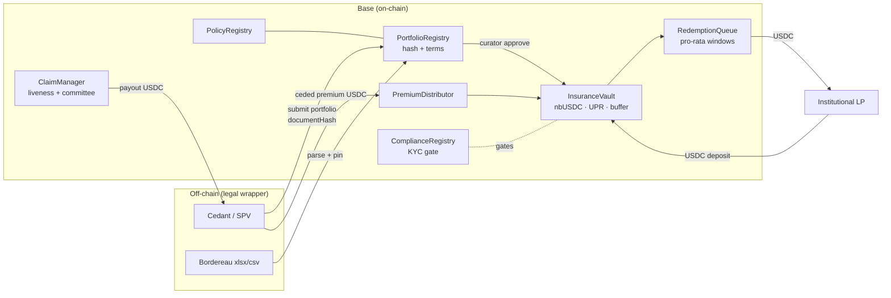

# NextBlock

**Institutional reinsurance tokenization protocol on Base.**

Ceded reinsurance portfolios are registered on-chain as RWA references,
capital is provided by whitelisted Institutional LPs through permissioned
ERC-4626 USDC vaults issuing restricted `nbUSDC` shares, and the full
underwriting lifecycle — portfolio assessment, premium/UPR accounting,
capacity allocation, claims with dispute paths, periodic-window redemptions —
is governed by explicit on-chain roles. Think **Lloyd's rebuilt as a tokenized
protocol**, not a consumer insurance app.

> **STATUS: Base Sepolia STAGING ONLY** (chain id 84532). The protocol has
> NOT received an external security audit. Do not use with real funds.
> Base-only by design: no other chains are operational targets.
> For the current done / advisory / open map, see
> [docs/PROJECT_STATUS.md](docs/PROJECT_STATUS.md).

## How it works



Confidentiality is by design: the bordereau (which carries insured-party
data) is parsed client-side (Excel/CSV), stored in a **private bucket**,
fingerprinted with keccak256 and anchored on-chain — IPFS carries only a
non-sensitive integrity manifest.

## Repository layout

| Path | Content |
|---|---|
| [`contracts/`](contracts/README.md) | Foundry workspace — 23 Solidity modules (`src/`, incl. `lending/`), 550+ unit/fuzz/invariant/fork/integration tests, deployment + ops scripts, [redeploy runbook](contracts/REDEPLOY_RUNBOOK.md), canonical deployment record (`deployments/84532-staging.json`) |
| [`app/`](app/README.md) | Next.js 15 frontend (wagmi/viem) + server API routes: KYB pipeline, claims evidence, notifications, confidential IPFS pinning, scheduled-job endpoints |
| [`scripts/`](scripts/) | Address-book codegen from the deployment record, with a byte-for-byte anti-drift check wired into CI |
| [`supabase/migrations/`](supabase/migrations/) | Versioned SQL — RLS deny-by-default everywhere; documents live in private buckets |
| [`indexer/`](indexer/README.md) | Goldsky subgraph for redemption-queue events |
| [`docs/`](docs/README.md) | **Start here** — documentation index: architecture, onboarding, project status, security model, ops runbooks, pilot guides, legal |
| [`audits/`](audits/README.md) | Audit readiness status and future report placeholders |
| [`.github/workflows/`](.github/workflows/) | CI (addressbook / frontend / contracts / security) + scheduled ops jobs + redemption keeper |

## Quick start

```bash
git clone https://github.com/antoncarlo/nextblock && cd nextblock
git submodule update --init --recursive   # pinned forge-std + OpenZeppelin

# Frontend checks (root scripts anchor npm to app/ and its lockfile)
npm run ci:frontend:install
npm run ci:frontend:lint
npm run ci:frontend:typecheck
npm run ci:frontend:build

# Address book anti-drift
npm run check:addressbook

# Contracts (requires Foundry; submodules pinned in .gitmodules)
npm run ci:contracts:fmt
npm run ci:contracts:build
npm run ci:contracts:test

# Audit-prep (manual, not in CI yet)
npm run audit:contracts:snapshot     # gas snapshot check vs committed baseline
npm run audit:contracts:coverage     # forge coverage summary
```

Full environment setup (env vars, Supabase, keeper, scheduled jobs):
[docs/DEVELOPER_ONBOARDING.md](docs/DEVELOPER_ONBOARDING.md).

## Protocol roles

| Role | Powers (bounded) |
|---|---|
| Owner | limited, auditable protocol admin — phase 1 live: `ProtocolTimelock` holds `OWNER_ROLE`/`DEFAULT_ADMIN_ROLE` with a Safe as proposer; deployer EOA retained until the rehearsed phase-2 handover ([ops](docs/OPERATIONS.md), [runbook](contracts/REDEPLOY_RUNBOOK.md)) |
| Underwriting Curator | portfolio due-diligence, approve/activate, expected-loss terms |
| Allocator | capacity allocation within caps and concentration limits (proposal + TTL) |
| Sentinel / Emergency Guardian | pause, challenge, circuit-break — can never move funds |
| Claims Committee | approval path for non-parametric claims after the liveness window |
| KYC Operator | ComplianceRegistry whitelist / KYC expiry / custody-venue approval |
| Cedant | submits portfolios & claims, pays ceded premium in USDC, receives payouts |
| Institutional LP | deposits USDC, holds restricted `nbUSDC`, exits via redemption windows |

Economic invariants (USDC conservation, no unbacked shares, UPR correctness,
exposure caps, liquidity lock, rounding direction) are enforced in code and
exercised by stateful invariant suites — see
[docs/SECURITY_MODEL.md](docs/SECURITY_MODEL.md).

## On-chain staging (Base Sepolia, 84532)

The canonical address book is `contracts/deployments/84532-staging.json`,
mirrored into the frontend by generated code (never by hand). A fresh
"real-spine" generation (one-way real-time lock, curator-parametrized
allocation) ships in the repo and is deployed via the
[redeploy runbook](contracts/REDEPLOY_RUNBOOK.md).

## CI & automation

| Workflow | What it does |
|---|---|
| `ci.yml` | `addressbook` anti-drift · `frontend` install/lint/typecheck/build (Node 22) · `contracts` fmt/build/test · security checks. No secrets required. |
| `scheduled-jobs.yml` | notifications + claims-audit refresh (5m), AI refresh (15m), sanctions rescreen (monthly) — Bearer `CRON_SECRET` |
| `redemption-keeper.yml` | settles matured redemption epochs (dedicated allocator key) |

## Security posture

- **No external audit yet** — [audit prep](contracts/docs/security/audit-prep.md)
  and [handoff](contracts/docs/security/audit-handoff.md) are maintained.
- Responsible disclosure: [SECURITY.md](SECURITY.md).
- The compliance gate is on-chain (ERC-3643-style transfer hooks), never
  frontend-only. Server routes are fail-closed; Supabase RLS is
  deny-by-default; the service-role key is server-only.

## Author

**Anton Carlo Santoro** — NextBlock Group Ltd.
